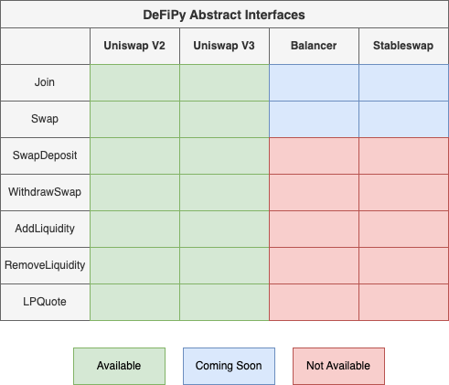

Overview
===============

.. _overview:

The two main ways to work with DeFiPy are either through the Primitive and/or Abstract API.

Primitive Interface
--------------------------

As the DeFiPy backbone consists of refactors of various DeFi (solidity) frameworks to analyze mock DeFi setups using Python, we've done our best to maintain the integrity of the original solidity interface in the pythonized verion that we offer. This option is best suited for solidity developers who are familiar with working with solidity interface, and want to use DeFiPy as an additional support resource.

Abstract Interface
--------------------------

This option is best suited for analysts who want to streamline their work to implement DeFi analytics on the various protocols that are made available. The following is an overiew of the available abstract interface objects. To learn more, you can visit Tutorials and/or API references in the left menu.

Objects
++++++++++++++++++++++++++++
1. ``Join()``: Join token amounts amounts to pool
2. ``Swap()``: Swap token exact x for token y, and vice versa
3. ``SwapDeposit()``: Deposit exact x or y by coming to pool with just one token from trading pair. Works by calculating portion to swap, performs swap to aquire other token, and performs 50/50 deposit with other token and remaining portion
4. ``WithdrawSwap()``: Withdraw exact x or y by leaving pool with desired token from trading pair. Works by calculating portion to withdraw, perform approximate 50/50 withdraw, swap remaining portion then return desired token
5. ``AddLiquidity()``: Enter one token and will calculate the other amount to perform 50/50 deposit
6. ``RemoveLiquidity()``: Enter one token and will calculate the other amount to perform 50/50 withdrawal

